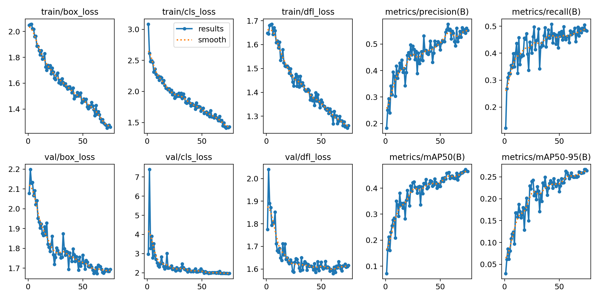
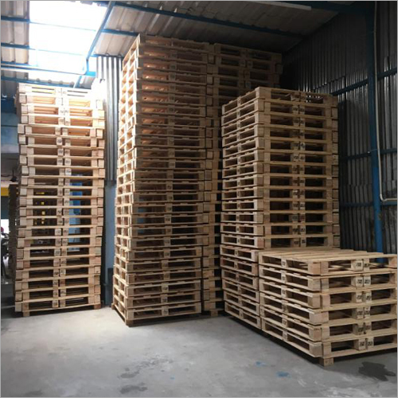
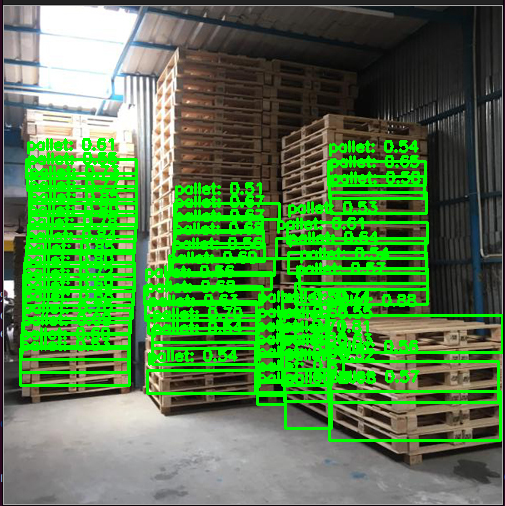
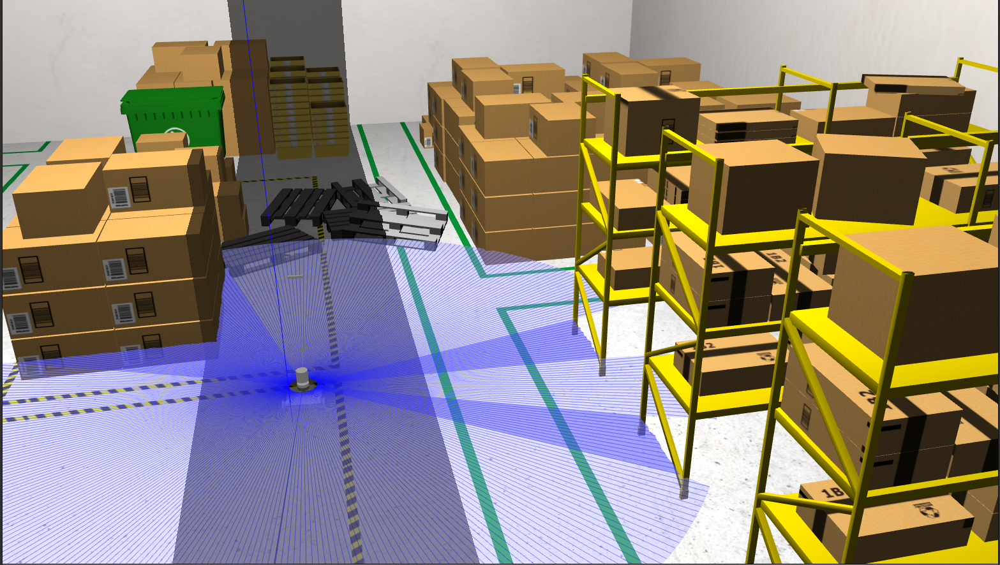
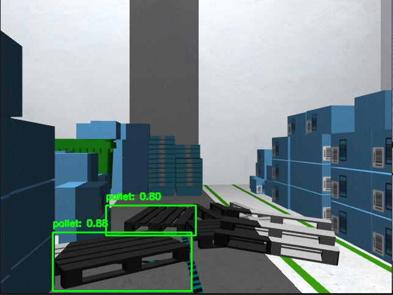

# Detecting Pallets in ROS2
A custom trained Yolov11 model to Detect Pallets which can be used with ROS2

This model can be used in realtime camera or in a Simulation and can be run as a ROS Node which subscribes to a camera topic and detects Pallets.

## Dataset
The Dataset is formed in the COCO Dataset format as YOLO models are pre trained on the COCO Dataset.

The code for creating the Dataset can be found in [Dataset Creation](Dataset_code).
The Annotations were created using the Roboflow Model which created annotations for the images and stored the labels in the correct COCO Dataset Format. When using the code ensure to use your Roboflow API key.

The Dataset can be found in this Drive link: https://drive.google.com/drive/folders/1PoIG5pQE3XiWKK5uAGIh4leXDZ-Nu7BQ?usp=sharing

## Model Details
A Pre trained YOLOv11 model was used and then trained further to detect pallets using the dataset above. The Model was trained on Colab using the T4 GPU for 75 epochs at 0.01 Learning Rate.
The code for training the model can be found in [Model_description](Model_description), a corresponding yaml file is also present which is called during training and has information about the pallet class.

The trained model can be found here [YOLOv11 Pallets](yolov11_pallets.pt). You can download this .pt file and call this model for any task you want.

The model weights can be found in this drive link: https://drive.google.com/drive/folders/1-6xyLXygvwwHC8LZ6ZWVsRysuN3HguaD?usp=sharing

The pretained model was evaluated using mAP50 and mAP50-95:

Other Results can be found in [Results](Results), it even consists of a .csv file containing all the results [Results.csv](Results/results.csv).

The code [pallet_detection.py](pallet_detection.py) takes an image as an input and detects pallets using our custom trained model. Ensure to change the path respectively.

We gave the input image as:

 

The Output after running it with the pallet_detection.py code is:

## ROS2 Node

A python node is written which subscirbes to an image topic being published either from a real/simulated camera or a depth camera and performs real time pallet detection.
The node can be found here [Pallet_sim.py](Pallet_sim.py). Ensure to change the path and topic respectively.

We ran this node on a simulation of a warehouse where few pallets were placed:

The result after running the Node:

## Thank you!
